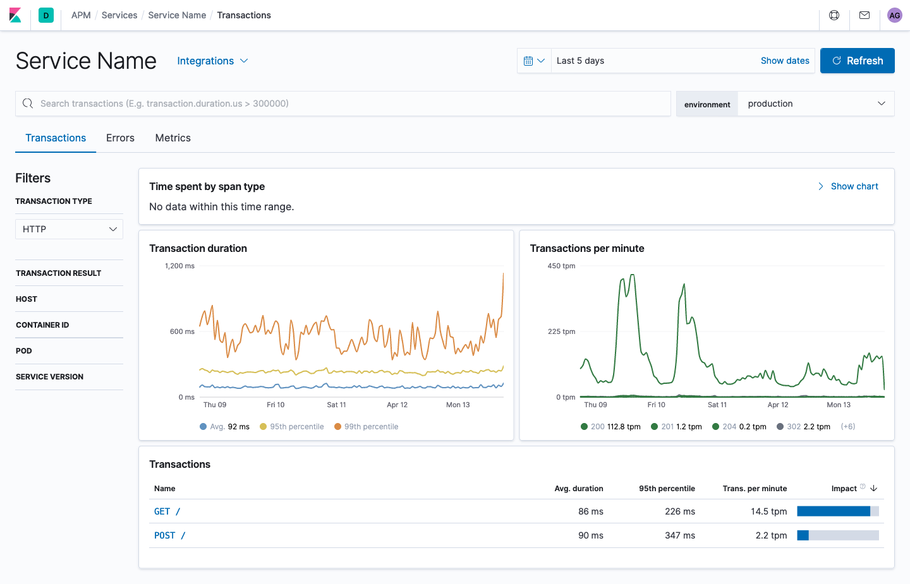
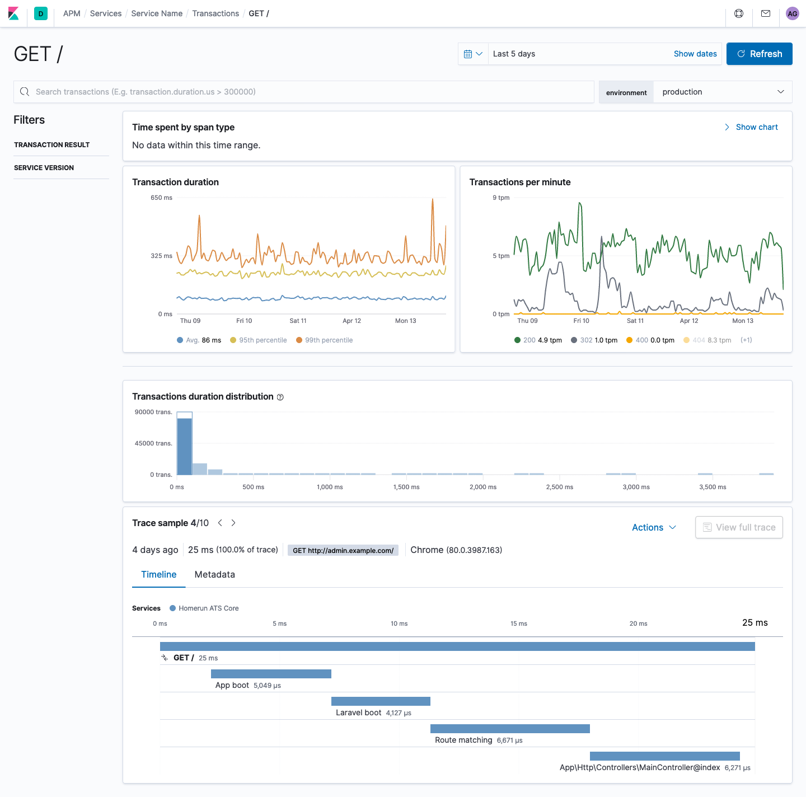

# Elastic APM

[](https://circleci.com/gh/arkaitzgarro/elastic-apm-laravel)
[](https://packagist.org/packages/arkaitzgarro/elastic-apm-laravel)
[](https://codeclimate.com/github/arkaitzgarro/elastic-apm-laravel/test_coverage)
[](https://packagist.org/packages/arkaitzgarro/elastic-apm-laravel)

Elastic APM agent for v2 intake API. Compatible with Laravel 6+.

| Transactions list                             | Transaction detail                              |
| --------------------------------------------- | ----------------------------------------------- |
|  |  |

## Prerequisites

You are responsible for completing the following as part of installing this package.

### HTTP Client

In order to minimize potential dependency conflicts, this package does not dictate the HTTP client which will be used to send data to APM. Instead, your project must include a suitable [PSR-18](https://www.php-fig.org/psr/psr-18/) compatible implementation. The easiest way to do this is using the [php-http](http://docs.php-http.org/en/latest/) adapter for GuzzleHTTP. Require either the guzzle6 or guzzle7 adapter, depending on your specific needs.

```bash
    # if you are using guzzlehttp/guzzle version 6
    # note that you must use >=2.0 of the guzzle6-adapter
    composer require php-http/guzzle6-adapter
```

```bash
    # if you are using guzzlehttp/guzzle version 7
    composer require php-http/guzzle7-adapter
```

## Installation

Require this package with composer:

```bash
# Laravel 6+
composer require arkaitzgarro/elastic-apm-laravel

# Laravel 5.5 - 5.8
composer require arkaitzgarro/elastic-apm-laravel:^2.0
```

Laravel's provider auto-discover should find the package ServiceProvider. Otherwise, add the ServiceProvider class to the providers array in `config/app.php`:

```php
'providers' => [
    // ... more providers
    \AG\ElasticApmLaravel\ServiceProvider::class,
],
```

From here, we will take care of everything based on your configuration. The agent and the middleware will be registered, and transactions will be sent to Elastic.

## Agent configuration

The underlying APM Agent may be configured using environment variables as of version 2.0 of this package. Place the `ELASTIC_APM_*` variables in your `.env` file or use any other appropriate means to make them available to your project.

Note that features of the Agent may not be documented here and you should refer to the `nipwaayoni/elastic-apm-php-agent` [project documentation](https://github.com/nipwaayoni/elastic-apm-php-agent/blob/master/docs/config.md) for the full feature set.

The following options are still supported by this package and will take precedence over their `ELASTIC_APM_*` counterparts if present.

| Variable          | Alternative | Description |
|-------------------|-------------|-------------|
|APM_ACTIVE         | ELASTIC_APM_ENABLED |  `true` or `false` defaults to `true`. If `false`, the agent will collect, but not send, transaction data; span collection will also be disabled. |
|APM_APPNAME        | ELASTIC_APM_SERVICE_NAME |  Name of the app as it will appear in APM. Invalid special characters will be replaced with a hyphen. |
|APM_APPVERSION     | ELASTIC_APM_SERVICE_VERSION |  Version of the app as it will appear in APM. |
|APM_SERVERURL      | ELASTIC_APM_SERVER_URL |  URL to the APM intake service. |
|APM_SECRETTOKEN    | ELASTIC_APM_SECRET_TOKEN |  Secret token, if required. |
|APM_BACKTRACEDEPTH | ELASTIC_APM_STACK_TRACE_LIMIT |  Defaults to `0` (unlimited). Depth of backtrace in query span. |

The `APM_*` variables listed above _may_ be removed in a future release.

### Laravel Options

The following environment variables are supported in the default configuration:

| Variable          | Description |
|-------------------|-------------|
|APM_LOG_LEVEL      | Log level for the APM Agent package. Must be PSR-3 compliant. Defaults to `error`. |
|APM_ACTIVE_CLI     | `true` or `false` defaults to `true`. If `false`, the agent will not collect or send transaction or span data for non-HTTP requests but HTTP requests will still follow ELASTIC_APM_ENABLED. When ELASTIC_APM_ENABLED is `false`, this will have no effect. |
|APM_USEROUTEURI    | `true` or `false` defaults to `true`. The default behavior is to record the URL as defined in your routes configuration. Set to `false` to record the requested URL, but keep in mind that this can result in excessive unique entries in APM. |
|APM_IGNORE_PATTERNS| Ignore specific routes or jobs by transaction name. Should be a regular expression, and will match multiple patterns via pipe `\|` in the regex. Note that 4 backslashes should be used to match a single backslash. Example: `"/\/health-check\|^OPTIONS \|Foo\\\\Bar\\\\Job/"` |
|APM_QUERYLOG       | `true` or `false` defaults to 'true'. Set to `false` to completely disable query logging, or to `auto` if you would like to use the threshold feature. |
|APM_THRESHOLD      | Query threshold in milliseconds, defaults to `200`. If a query takes longer then 200ms, we enable the query log. Make sure you set `APM_QUERYLOG=auto`. |
|APM_MAXTRACEITEMS  | Defaults to `1000`. Max number of child items displayed when viewing trace details. |

You may also publish the `elastic-apm-laravel.php` configuration file to change additional settings:

```bash
php artisan vendor:publish --tag=config
```

Once published, open the `config/elastic-apm-laravel.php` file and review the various settings.

## Logging

The Monolog instance used by your Laravel application will be automatically given to the Agent for logging. The log level for the Agent package is independent of the log level for your Laravel application. This allows you to only include Agent messages when they are useful. Use the `APM_LOG_LEVEL` environment setting for this. The default log level for the agent package is `info`.

## Collectors

The default collectors typically listen on events to measure portions of the request such as framework loading, database queries, or jobs.

The SpanCollector in particular allows you to measure any section of your own code via the `ApmCollector` Facade:

```php
use AG\ElasticApmLaravel\Facades\ApmCollector;

ApmCollector::startMeasure('my-custom-span', 'custom', 'measure', 'My custom span');

// do something amazing

ApmCollector::stopMeasure('my-custom-span');
```

To record an additional span around your job execution, you may include the provided [job middleware](https://laravel.com/docs/6.x/queues#job-middleware):

```php
public function middleware()
{
    return [
        app(\AG\ElasticApmLaravel\Jobs\Middleware\RecordTransaction::class),
    ];
}
```

**Note** Job middleware is **not** run when a job is created with the `dispatchNow()` method. Spans explicitly created within the job will still be collected, but the overall job span will not be included.
 
### Add a collector for other events

You can add extra collector(s) to listen to your own application events or Laravel events like `Illuminate\Mail\Events\MessageSending` for example. We created a base collector that already includes functionality to measure events, that you can extend from:

```php
// app/Collectors/MailMessageCollector.php

namespace YourApp\Collectors;

use AG\ElasticApmLaravel\Contracts\DataCollector;
use AG\ElasticApmLaravel\Collectors\EventDataCollector;

use Illuminate\Mail\Events\MessageSending;
use Illuminate\Mail\Events\MessageSent;

class MailMessageCollector extends EventDataCollector implements DataCollector
{
    public function getName(): string
    {
        return 'mail-message-collector';
    }

    protected function registerEventListeners(): void
    {
        $this->app->events->listen(MessageSending::class, function (\Swift_Message $message) {
            $this->startMeasure(
                'mail #' . $message->getId(),
                'mail.delivery',
            );
        });

        $this->app->events->listen(MessageSent::class, function (\Swift_Message $message) {
            $this->stopMeasure('mail #' . $message->getId());
        });
    }
}

```

Don't forget to register your collector when the application starts:

```php
// app/Providers/AppServiceProvider.php

use AG\ElasticApmLaravel\Facades\ApmCollector;

use YourApp\Collectors\MailMessageCollector;

public function boot()
{
    // ...
    ApmCollector::addCollector(MailMessageCollector::class);
}
```

Alternatively, you can now simply tag your collector in the container and it will be discovered. Note that the collector **must** be tagged before the `Agent` is first resolved from the container, normally in the `boot` method of your provider.

```php
// app/Providers/AppServiceProvider.php

use YourApp\Collectors\MailMessageCollector;

public function boot()
{
    $this->app->tag(MailMessageCollector::class, \AG\ElasticApmLaravel\ServiceProvider::COLLECTOR_TAG);
}
```

**Note** Collecting events is subject to the `APM_MAXTRACEITEMS` setting. If your collector defers adding events until the request is complete, and the total event count exceeds the max trace items, a higher than expected number of your events may be dropped. You should make every effort to collect events at the point they occur during the request processing. Using the `EventDataCollector::startMeasure()` method will flag an event for collection even if the max trace items has been reached when the measure is stopped.

## Distributed Tracing

[Distributed tracing](https://www.elastic.co/guide/en/apm/get-started/current/distributed-tracing.html) allows you to associate transactions in your Laravel application with transactions in services your application consumes. For example, if your Laravel application calls REST resources as part of handling a request, the REST transaction details will appear within your application transaction in Elastic APM. You enable distributed tracing by including an appropriate header in the http request your application makes to another service. For example:

```php
$request = new Request(
    'PUT',
    '/some/backend/resource',
    [
        'Content-Type' => 'application/json',
    ],
    json_encode(...)
);

$request = \AG\ElasticApmLaravel\Facades\ApmAgent::addTraceParentHeader($request);

$this->client->send($request);
```

If you are not dealing with a `RequestInterface` object, you can get the current transaction and use the [array or string methods](https://github.com/nipwaayoni/elastic-apm-php-agent/blob/master/docs/examples/distributed-tracing.md) to get the `traceparent`.

```php
$transaction = ApmAgent::getCurrentTransaction();

$headerArray = $transaction->traceHeaderAsArray();
$headerString = $transaction->traceHeaderAsString();
```

## Development

Get Composer. Follow the instructions defined on the official [Composer page](https://getcomposer.org/doc/00-intro.md), or if you are using `homebrew`, just run:

```bash
brew install composer
```

Install project dependencies:

```bash
composer install
```

Run the unit test suite:

```bash
php vendor/bin/codecept run
```

Please adhere to [PSR-2](https://github.com/php-fig/fig-standards/blob/master/accepted/PSR-2-coding-style-guide.md) and [Symfony](https://symfony.com/doc/current/contributing/code/standards.html) coding standard. Run the following commands before pushing your code:

```bash
php ./vendor/bin/php-cs-fixer fix --config .php_cs
```

### Integrate with a running application

To be able to test your changes with a locally running application, use Composer's functionality to require packages from local paths. On your project, add a local repository, just make sure the path to `elastic-apm-laravel` folder is correct:

```bash
composer config repositories.local '{"type": "path", "url": "../elastic-apm-laravel"}' --file composer.json
```

Then install the package from the source:

```bash
composer require arkaitzgarro/elastic-apm-laravel:@dev --prefer-source
```

You should see a message indicating that the package has been installed as symlink:

```bash
- Installing arkaitzgarro/elastic-apm-laravel (dev-chore/branch-name): Symlinking from ../elastic-apm-laravel
```
